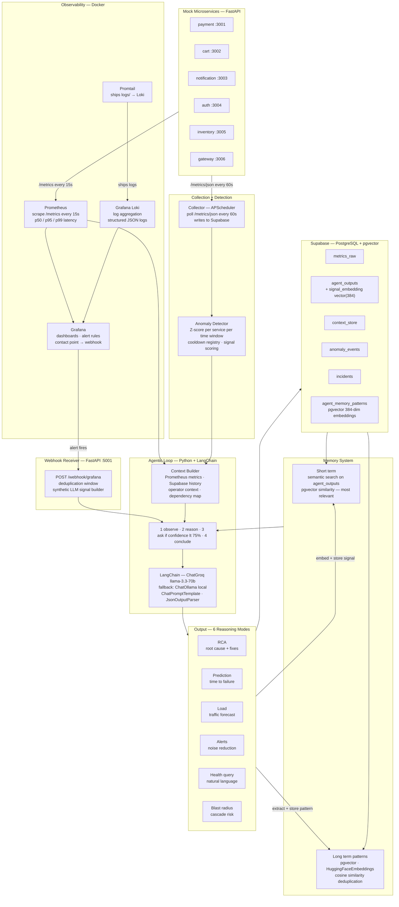

<h1 align="center">SRE Agent</h1>
<p align="center">
  <b>AI-powered microservice monitoring and decision-support system</b><br/>
  Predicts failures, performs root cause analysis, reduces alert noise,<br/>
  and estimates blast radius — before things go wrong.
</p>

<p align="center">
  
  
  
  
  
  
  
  
  
</p>

---

## What is this?

Most monitoring tools tell you **what broke**. This agent tells you **why it broke, what is about to break, and what to do about it** — before your users notice.

It monitors multiple microservices continuously, detects anomalies using statistical baselines (not hardcoded thresholds), feeds rich contextual signals to an LLM, and produces actionable analysis in plain English.

The agent is **context-aware**. You tell it things like:

> *"There will be a power outage on 3rd March from 2-6 AM"*
> *"Buy 1 Get 1 offer starts in 2 days"*
> *"New movie releases on 9th April — expecting huge traffic"*

The agent factors these into every prediction, RCA, and load forecast automatically. It does not just match patterns — it **reasons**.

---

## Versions

### v3.1 — Current
Grafana Loki log aggregation. Intelligent semantic memory retrieval using pgvector similarity search on agent outputs — agent now finds the most relevant past decisions rather than the most recent ones. Single-terminal startup via `start.py`. Structured JSON logging across all components shipped to Loki via Promtail.

### v3.0 — LangChain Integration
Full LangChain integration across the LLM and prompt layers. Manual `httpx` HTTP calls replaced with `ChatGroq` and `ChatOllama`. All 6 reasoning modes use `ChatPromptTemplate` objects. Embeddings migrated to `HuggingFaceEmbeddings` via `langchain-huggingface`. Pydantic output schemas added for structured LLM outputs.

### v2.2 — Webhook Support + pgvector Memory
Grafana alert webhooks trigger the agent directly. Memory deduplication upgraded to pgvector cosine similarity. Cooldown registry prevents domino triggering.

### v2.1 — Two-tier Memory
Short-term (last 48h) and long-term (pgvector) memory. Pattern extraction after every agent run. Full reasoning transparency — agent displays which memories it drew from.

### v2.0 — Prometheus + Grafana
Full observability stack. Agent uses p50/p95/p99 latency from Prometheus instead of averages. Live Grafana dashboards show real-time service health.

### v1.0 — Base Agent
Core agentic loop with all 6 reasoning modes. Metrics sourced from Supabase only.

See [Releases](../../releases) to download any version.

---

## Features

| Feature | Description |
|---|---|
| **Automated RCA** | Determines why a service failed — rules out causes, identifies root source, suggests concrete fixes |
| **Predictive Degradation** | Predicts when a service will fail based on trend trajectory and upcoming events |
| **Load Prediction** | Forecasts future traffic using historical patterns and operator-provided event context |
| **Smart Alert Noise Reduction** | Groups N correlated alerts into M meaningful incidents, suppresses noise |
| **Natural Language Health Query** | Ask "Which services were unstable this weekend?" and get a direct answer |
| **Blast Radius Estimator** | When a service degrades, predicts which downstream services will be affected and by how much |
| **Operator Context** | User feeds plain-English events; agent uses them to reason about all predictions |
| **Agentic Loop** | If confidence is low, agent asks the user a targeted question before concluding |
| **Semantic Memory** | Agent retrieves the most relevant past incidents using pgvector similarity — not just the most recent |
| **Grafana Alerts** | Alert rules trigger the agent within 10-25 seconds — no waiting for the 60s collector poll |
| **Loki Log Aggregation** | Structured JSON logs from all components shipped to Grafana Loki via Promtail |
| **Single Terminal Startup** | All components start with one command — `python start.py` |

---

## Architecture



### Why Z-score instead of thresholds?

A response time of 800ms at 3 AM is suspicious. The same 800ms during a Friday evening flash sale is normal. Fixed thresholds cannot tell the difference. The anomaly engine builds a rolling baseline per service per time-of-day window and flags deviations in standard deviations — not absolute values.

### Why semantic memory retrieval?

The agent embeds each anomaly signal as a 384-dimensional vector and stores it alongside every agent output. On the next run, it searches past decisions by vector similarity — finding the most semantically relevant past experience regardless of when it happened. Running RCA on a CPU spike retrieves past CPU-related RCAs, not unrelated load predictions.

### Why Prometheus, Loki, and Supabase together?

| Prometheus | Loki | Supabase |
|---|---|---|
| Live p50/p95/p99 latency | Structured logs from all components | Agent outputs and memory patterns |
| Real-time scraping every 15s | Shipped via Promtail automatically | Anomaly events and baselines |
| Powers Grafana metric dashboards | Searchable in Grafana Explore | Operator context store |

All three are visible in one Grafana instance — metrics, logs, and agent history in one place.

### Why operator context matters

The LLM receives all user-provided context as a plain-text block in every prompt:

```
[2026-06-02] Buy 1 Get 1 offer starts in 2 days
[2026-06-01] Flash sale every Friday 6-9 PM, 3-4x load expected
[2026-06-01] Deployment of payment service v2.3 today at 12:15 PM
```

This lets the agent reason: "Payment service is degrading AND a BOGO offer starts in 2 days — current trajectory will breach SLA before the sale. Scale now, not when it crashes."

### Why pgvector for memory deduplication?

The agent extracts a structured pattern after every RCA and prediction run. Without vector similarity, "DB connection pool exhaustion after deployment" and "database pool saturated by new queries" would be stored as two separate records. pgvector cosine similarity catches these as the same pattern (similarity > 0.85) and updates the existing record instead of inserting a duplicate — memory gets smarter over time instead of noisier.

Note: Chroma can also be used as an alternative vector store.

---

## Tech Stack

| Layer | Technology | Purpose |
|---|---|---|
| Mock services | **FastAPI** (Python) | 6 simulated microservices with realistic failure modes |
| Metrics collection | **Prometheus** | Scrapes all services every 15s, stores p50/p95/p99 |
| Log aggregation | **Grafana Loki + Promtail** | Ships structured JSON logs from all components to Grafana |
| Visualization | **Grafana** | Live dashboards, alert rules, log explorer |
| Scheduler | **APScheduler** | Polls services every 60s, runs anomaly detection |
| Database | **Supabase (PostgreSQL + pgvector)** | Agent outputs, baselines, context, memory patterns |
| Anomaly detection | **Pure Python (Z-score + linear regression)** | Context-aware, per-service, per-time-window, cooldown gating |
| LLM (primary) | **Groq API** via `langchain-groq` — `llama-3.3-70b-versatile` | Fast, free-tier LLM inference |
| LLM (fallback) | **Ollama** via `langchain-ollama` — local Llama 3.1 | Offline fallback if Groq unavailable |
| LLM framework | **LangChain** | Unified LLM interface, prompt templates, structured output parsing |
| Embeddings | **HuggingFaceEmbeddings** — `all-MiniLM-L6-v2` (384-dim) | Local embeddings for pgvector semantic search and deduplication |
| Memory retrieval | **pgvector similarity search** | Finds most relevant past decisions by cosine similarity |
| Agent framework | **Pure Python agentic loop** | Full control over observe → reason → ask → conclude |
| Webhooks | **FastAPI** on port 5001 | Receives Grafana alerts, triggers agent with deduplication |
| Logging | **Structured JSON + agent/logger.py** | All component logs shipped to Loki |
| CLI | **Rich** (Python) | Terminal output and interactive prompts |
| Containers | **Docker** | Runs Prometheus, Grafana, Loki, Promtail |

---

## Project Structure

```
sre_agent/
  start.py                      # Single entry point — starts everything in one terminal
  docker-compose.yml            # Prometheus + Grafana + Loki + Promtail

  db/
    schema.sql                  # All Supabase tables including pgvector columns
    rpc_functions.sql           # pgvector similarity search RPC functions
    database.py                 # All DB operations
    seed.py                     # 7 days of realistic mock data

  collector/
    collector.py                # APScheduler — polls services, cooldown gating, agent trigger
    anomaly_detector.py         # Z-score + trend + fallback thresholds

  services/
    base_service.py             # Base class with Prometheus metrics + background simulator
    definitions.py              # 6 service instances with realistic baselines
    service_runner.py           # Starts all 6 services simultaneously
    simulate_incident.py        # CLI tool to trigger demo incident scenarios

  agent/
    llm_adapter.py              # LangChain — ChatGroq/ChatOllama, ask_llm, ask_llm_from_template
    prompts.py                  # System prompt strings + ChatPromptTemplate objects
    context_builder.py          # Assembles full context — Prometheus + Supabase + operator context
    prometheus_adapter.py       # Queries Prometheus HTTP API with PromQL
    agent_loop.py               # Core loop: observe → reason → ask → conclude
    memory.py                   # Semantic retrieval — pgvector search on agent_outputs + patterns
    embeddings.py               # HuggingFaceEmbeddings wrapper
    logger.py                   # Structured JSON logger — writes to logs/ shipped by Promtail

  api/
    webhook_receiver.py         # FastAPI :5001 — Grafana alerts → agent trigger
    decisions_api.py            # FastAPI :5000 — agent outputs for Grafana (parked)
    parsers/
      grafana.py                # Grafana unified alerting payload parser
      normaliser.py             # Converts alert formats to internal schema

  config/
    dependency_map.py           # Service dependency graph for blast radius
    prometheus.yml              # Prometheus scrape config
    loki.yml                    # Loki log storage config
    promtail.yml                # Promtail — watches logs/ and ships to Loki
    grafana/
      provisioning/
        datasources/            # Auto-connects Grafana to Prometheus + Loki
        dashboards/             # Pre-built SRE Agent service overview dashboard

  logs/                         # Component log files — watched by Promtail → Loki
    collector.log
    services.log
    webhook.log
    agent.log

  main.py                       # Agent CLI — all user interaction
  .env.example                  # Environment variable template
  requirements.txt
```

---

## Getting Started

### Prerequisites
- Python 3.10+
- Docker Desktop
- A free [Supabase](https://supabase.com) account
- A free [Groq](https://console.groq.com) API key

### Setup

**1. Clone the repo**
```bash
git clone https://github.com/Sharvin-1816/SRE-Agent.git
cd SRE-Agent
```

**2. Install dependencies**
```bash
pip install -r requirements.txt
```

**3. Set up Supabase**
- Create a new project at supabase.com
- Go to SQL Editor → paste and run `db/schema.sql`
- Go to SQL Editor → paste and run `db/rpc_functions.sql`
- Enable pgvector: `CREATE EXTENSION IF NOT EXISTS vector;`
- Add memory embedding columns per schema.sql instructions

**4. Configure environment**
```bash
cp .env.example .env
# Fill in SUPABASE_URL, SUPABASE_SERVICE_KEY, GROQ_API_KEY
```

**5. Seed the database**
```bash
python db/seed.py
```

**6. Start everything with one command**
```bash
python start.py
```

This starts all components automatically:
- Docker (Prometheus + Grafana + Loki + Promtail)
- 6 mock microservices
- Collector + anomaly detection
- Webhook receiver
- Agent CLI

**7. Set up Grafana Alert Rules** (one-time setup)

Go to `http://localhost:3000` → Alerting → Alert rules:

| Rule | Query | Condition | Pending |
|---|---|---|---|
| Service Down | `up{job="sre_services"}` | IS BELOW 1 | None |
| High Error Rate | `max by(service_name) (sre_error_rate_percent)` | IS ABOVE 5 | 30s |
| High p95 Latency | `max by(service_name) (histogram_quantile(0.95, rate(sre_request_duration_ms_bucket[2m])))` | IS ABOVE 4000 | 30s |
| High CPU Usage | `max by(service_name) (sre_cpu_percent)` | IS ABOVE 90 | 30s |

For each rule: folder = `SRE Agent`, evaluation group = `sre-agent-group` (interval 10s).

Then create a contact point: Alerting → Notification configuration → Add contact point → Type: Webhook → URL: `http://host.docker.internal:5001/webhook/grafana`

When an alert fires, Grafana POSTs to the webhook receiver which triggers the agent within 10-25 seconds — no waiting for the 60s collector poll.

**9. Open Grafana**
- Go to `http://localhost:3000`
- Login: `admin` / `sreagent`
- Dashboards → SRE Agent → Service Overview

---

## CLI Commands

| Command | What it does |
|---|---|
| `context` | Add free-text operator context (events, outages, deployments) |
| `contexts` | View and manage all saved context entries |
| `status` | Live health table — Prometheus and Loki status |
| `query` | Ask a natural language question about system health |
| `predict` | Run load and capacity prediction |
| `blast` | Estimate blast radius if a service fails |
| `alerts` | Run alert noise reduction on current alerts |
| `simulate` | Trigger an incident scenario for demo |
| `memory` | View all stored long term memory patterns |
| `webhooks` | Show webhook receiver status and recent activity |
| `logs` | View recent logs from all components via Loki |

---

## Simulate an Incident

```bash
agent: simulate
```

| Scenario | Tests |
|---|---|
| Payment gradual degradation | Predictive degradation + RCA |
| Cascading failure payment → cart | Blast radius estimator |
| Black Friday 5x surge | Load prediction |
| Gateway full outage | Alert noise reduction |

After triggering, watch Grafana for the spike. The agent triggers automatically via Grafana alert within 10-25 seconds.

---

## Viewing Logs

All component logs are structured JSON shipped to Loki automatically.

**From the CLI:**
```
agent: logs
```

**From Grafana:**
- Go to `http://localhost:3000` → Explore
- Select **Loki** datasource
- Query: `{job=~"sre_.*"}` — all components
- Query: `{component="collector"} |= "Anomaly"` — anomaly events only
- Query: `{component="agent"} |= "RCA"` — agent decisions only

---

## Extending to Real APIs

Change one section in `collector/collector.py`:

```python
SERVICES = {
    "your_payment_api":  "https://api.yourcompany.com/payment",
    "your_auth_api":     "https://api.yourcompany.com/auth",
}
```

Update `config/prometheus.yml` targets to point to your real service `/metrics` endpoints. Everything else — anomaly detection, baselines, agent reasoning, memory, logging — works identically on real data.

---

## Changelog

### v3.1
- Added Grafana Loki log aggregation — structured JSON logs from all components shipped via Promtail
- Intelligent semantic memory retrieval — agent finds most relevant past decisions using pgvector similarity search on `agent_outputs` table, not just most recent
- Memory now filters by mode relevance — RCA retrieves past RCAs and predictions, blast radius retrieves past blast radius runs
- Signal embeddings stored alongside every agent output for future retrieval
- New `logs` CLI command — queries Loki API directly, falls back to local files
- `agent/logger.py` — structured JSON logger used by collector, webhook receiver, and agent loop
- Single terminal startup — `python start.py` replaces running 5 separate terminals
- All background component output redirected to `logs/` directory
- Fixed Windows readline conflict on Ctrl+C shutdown
- Domino prevention — cooldown registry (10 min per service) stops repeated agent triggers
- Grafana alert rules set up — Service Down, High Error Rate, High p95 Latency, High CPU Usage

### v3.0
- Integrated LangChain across the LLM and prompt layers
- Replaced manual `httpx` Groq and Ollama HTTP calls with `ChatGroq` and `ChatOllama`
- Added `ask_llm_from_template` and `ask_llm_structured` helpers
- Added Pydantic output schemas: `RCAOutput`, `PredictionOutput`, `BlastRadiusOutput`
- Converted all 6 reasoning mode system prompts to `ChatPromptTemplate` objects
- Replaced `SentenceTransformer` with `HuggingFaceEmbeddings` from `langchain-huggingface`
- Fixed numpy Python 3.13 wheel compatibility and supabase/httpx version conflict

### v2.2
- Added Grafana webhook support — alert rules trigger the agent via `POST /webhook/grafana`
- Deduplication window (5 min per service) prevents rate limit hammering
- pgvector cosine similarity for memory deduplication
- Database client supports both `SUPABASE_SERVICE_KEY` and `SUPABASE_ANON_KEY`

### v2.1
- Two-tier memory system — short term (last 48h) and long term patterns
- Pattern extraction after every RCA and prediction run
- Agent displays which memories it drew from after every analysis
- New `memory` CLI command

### v2.0
- Prometheus integration — scrapes all 6 services every 15s
- Agent uses p50/p95/p99 latency instead of averages
- Grafana dashboards — request rate, latency percentiles, CPU, memory, errors
- Fixed UUID truncation bug in alert grouping

### v1.0
- Initial release — 6 mock FastAPI microservices
- APScheduler-based metrics collector
- Z-score + trend anomaly detection
- Agentic loop: observe → reason → ask user → conclude
- 6 reasoning modes: RCA, prediction, load, alerts, health query, blast radius
- Operator context system
- Groq API (LLM) with Ollama fallback

---

## Roadmap

- [x] Prometheus + Grafana observability
- [x] Two-tier memory (short term + long term with pgvector)
- [x] Grafana webhook integration
- [x] LangChain integration
- [x] Grafana alert rules — near-instant detection (10-25s)
- [x] Semantic memory retrieval (pgvector similarity search)
- [x] Grafana Loki log aggregation
- [x] Single terminal startup
- [ ] Agent decision panel in Grafana
- [ ] Scheduled proactive analysis (not just on anomaly)
- [ ] OpenTelemetry distributed tracing
- [ ] Memory outcome tracking automation
- [ ] Slack/Teams notification integration

---

<p align="center">Built with Python · LangChain · Groq · Supabase · pgvector · Prometheus · Grafana · FastAPI · Rich</p>