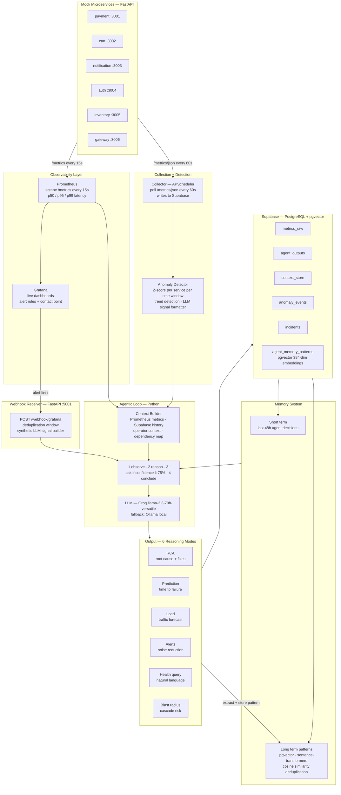

<h1 align="center">SRE Agent 🤖</h1>
<p align="center">
  <b>AI-powered microservice monitoring and decision-support system</b><br/>
  Predicts failures, performs root cause analysis, reduces alert noise,<br/>
  and estimates blast radius — before things go wrong.
</p>

<p align="center">
  
  
  
  
  
  
  
  
</p>

---

## What is this?

Most monitoring tools tell you **what broke**. This agent tells you **why it broke, what's about to break, and what to do about it** — before your users notice.

It monitors multiple microservices continuously, detects anomalies using statistical baselines (not hardcoded thresholds), feeds rich contextual signals to an LLM, and produces actionable analysis in plain English.

The agent is **context-aware**. You tell it things like:

> *"There will be a power outage on 3rd March from 2-6 AM"*  
> *"Buy 1 Get 1 offer starts in 2 days"*  
> *"New movie releases on 9th April — expecting huge traffic"*

The agent factors these into every prediction, RCA, and load forecast automatically. It doesn't just match patterns — it **reasons**.

---

## Versions

### v3.0 — Current (LangChain Integration)
Full LangChain integration across the LLM and prompt layers. LLM providers (`ChatGroq`, `ChatOllama`) replace raw HTTP calls. All 6 reasoning modes use `ChatPromptTemplate` objects. Embeddings migrated to `HuggingFaceEmbeddings` via `langchain-huggingface`. Pydantic output schemas (`RCAOutput`, `PredictionOutput`, `BlastRadiusOutput`) added for structured LLM outputs. OpenTelemetry removed (not integrated).

### v2.1 — Two-tier Memory
Added short-term (last 48h) and long-term (pgvector) memory system. Pattern extraction after every agent run. Full reasoning transparency — agent displays which memories it drew from. New `memory` CLI command.

### v2.0 — Prometheus + Grafana
Full observability stack. Agent uses p50/p95/p99 latency from Prometheus instead of averages. Live Grafana dashboards show real-time service health. Grafana alert webhooks trigger the agent directly.

### v1.0 — Base Agent
Core agentic loop with all 6 reasoning modes. No Prometheus — metrics sourced from Supabase only. Fully functional agent reasoning.

See [Releases](../../releases) to download any version.

---

## Features

| Feature | Description |
|---|---|
| **Automated RCA** | Determines why a service failed — rules out causes, identifies root source, suggests concrete fixes |
| **Predictive Degradation** | Predicts when a service will fail based on trend trajectory and upcoming events |
| **Load Prediction** | Forecasts future traffic using historical patterns + operator-provided event context |
| **Smart Alert Noise Reduction** | Groups N correlated alerts into M meaningful incidents, suppresses noise |
| **Natural Language Health Query** | Ask *"Which services were unstable this weekend?"* and get a direct answer |
| **Blast Radius Estimator** | When a service degrades, predicts which downstream services will be affected and by how much |
| **Operator Context** | User feeds plain-English events; agent uses them to reason about all predictions |
| **Agentic Loop** | If confidence is low, agent asks the user a targeted question before concluding |

---

## Architecture



### Why Z-score instead of thresholds?

A response time of 800ms at 3 AM is suspicious. The same 800ms during a Friday evening flash sale is normal. Fixed thresholds can't tell the difference. The anomaly engine builds a **rolling baseline per service per time-of-day window** and flags deviations in standard deviations — not absolute values.

### Why Prometheus + Supabase together?

| Prometheus | Supabase |
|---|---|
| Live p50/p95/p99 latency | Agent outputs (every LLM response) |
| Real-time scraping every 15s | Anomaly events + z-score history |
| Powers Grafana dashboards | Baseline profiles per service |
| Agent live context | Operator context store |
| | Health query history |

Prometheus gives the agent richer data. Supabase gives it memory and history. Neither replaces the other.

### Why operator context matters

The LLM receives all user-provided context as a plain-text block in every prompt:

```
[2026-06-02] Buy 1 Get 1 offer starts in 2 days
[2026-06-01] Flash sale every Friday 6-9 PM, 3-4x load expected
[2026-06-01] Deployment of payment service v2.3 today at 12:15 PM
```

This lets the agent reason: *"Payment service is degrading AND a BOGO offer starts in 2 days — current trajectory will breach SLA before the sale. Scale now, not when it crashes."*

---

## Tech Stack

| Layer | Technology | Purpose |
|---|---|---|
| Mock services | **FastAPI** (Python) | 6 simulated microservices with realistic failure modes |
| Metrics collection | **Prometheus** | Scrapes all services every 15s, stores p50/p95/p99 |
| Visualization | **Grafana** | Live dashboards — request rate, latency, errors, CPU |
| Scheduler | **APScheduler** | Polls services every 60s, runs anomaly detection |
| Database | **Supabase (PostgreSQL)** | Agent outputs, baselines, context, incidents |
| Anomaly detection | **Pure Python (Z-score + linear regression)** | Context-aware, per-service, per-time-window |
| LLM (primary) | **Groq API** — `llama-3.3-70b-versatile` | Fast, free-tier LLM inference |
| LLM (fallback) | **Ollama** — local Llama 3.1 | Offline fallback if Groq unavailable |
| LLM framework | **LangChain** (`langchain`, `langchain-core`, `langchain-groq`, `langchain-ollama`, `langchain-huggingface`) | Unified LLM interface, prompt templates, structured output parsing |
| Agent framework | **Pure Python agentic loop** | Full control over observe→reason→ask→conclude |
| CLI | **Rich** (Python) | Terminal output and interactive prompts |
| Containers | **Docker** | Runs Prometheus + Grafana |

---

## Project Structure

```
sre_agent/
  docker-compose.yml          # Prometheus + Grafana containers

  db/
    schema.sql                # All 9 Supabase tables
    rpc_functions.sql         # Postgres time-window query functions
    database.py               # All DB operations
    seed.py                   # 7 days of realistic mock data

  collector/
    collector.py              # APScheduler — polls services, triggers agent
    anomaly_detector.py       # Z-score + trend → LLM signal formatter

  services/
    base_service.py           # Base class with Prometheus metrics + background simulator
    definitions.py            # 6 service instances with realistic baselines
    service_runner.py         # Starts all 6 services simultaneously
    simulate_incident.py      # CLI tool to trigger demo incident scenarios

  agent/
    llm_adapter.py            # Groq/Ollama swap — one flag in .env
    prompts.py                # System prompts for all 6 reasoning modes
    context_builder.py        # Assembles full context (Prometheus + Supabase + operator)
    prometheus_adapter.py     # Queries Prometheus HTTP API with PromQL
    agent_loop.py             # Core loop: observe → reason → ask → conclude

  config/
    dependency_map.py         # Service dependency graph for blast radius
    prometheus.yml            # Prometheus scrape config (all 6 services)
    grafana/
      provisioning/
        datasources/          # Auto-connects Grafana to Prometheus
        dashboards/           # Pre-built SRE Agent dashboard

  main.py                     # CLI entry point
  .env.example                # Environment variable template
  requirements.txt
```

---

## Getting Started

### Prerequisites
- Python 3.10+
- Docker Desktop
- A free [Supabase](https://supabase.com) account
- A free [Groq](https://console.groq.com) API key

### Setup

**1. Clone the repo**
```bash
git clone https://github.com/Sharvin-1816/SRE-Agent.git
cd SRE-Agent
```

**2. Install dependencies**
```bash
pip install -r requirements.txt
```

**3. Set up Supabase**
- Create a new project at supabase.com
- Go to SQL Editor → paste and run `db/schema.sql`
- Go to SQL Editor → paste and run `db/rpc_functions.sql`

**4. Configure environment**
```bash
cp .env.example .env
# Fill in SUPABASE_URL, SUPABASE_ANON_KEY, GROQ_API_KEY
```

**5. Seed the database**
```bash
python db/seed.py
```

**6. Start Prometheus + Grafana**
```bash
docker-compose up -d
```

**7. Run everything**

Open 3 terminals:
```bash
# Terminal 1 — mock services
python -m services.service_runner

# Terminal 2 — collector + anomaly detection
python -m collector.collector

# Terminal 3 — agent CLI
python main.py
```

**8. Open Grafana**
- Go to `http://localhost:3000`
- Login: `admin` / `sreagent`
- Dashboards → SRE Agent → Service Overview

---

## CLI Commands

| Command | What it does |
|---|---|
| `context` | Add free-text operator context (events, outages, deployments) |
| `contexts` | View and manage all saved context entries |
| `status` | Live health table + confirms if Prometheus is active |
| `query` | Ask a natural language question about system health |
| `predict` | Run load and capacity prediction |
| `blast` | Estimate blast radius if a service fails |
| `alerts` | Run alert noise reduction on current alerts |
| `simulate` | Trigger an incident scenario for demo |
| `memory` | View all stored long term memory patterns |

---

## Simulate an Incident

```bash
agent> simulate
```

| Scenario | Tests |
|---|---|
| Payment gradual degradation | Predictive degradation + RCA |
| Cascading failure payment → cart | Blast radius estimator |
| Black Friday 5x surge | Load prediction |
| Gateway full outage | Alert noise reduction |

After triggering, watch **Grafana** for the spike and **Terminal 2** for the agent's analysis.

---

## Extending to Real APIs

Change one section in `collector/collector.py`:

```python
SERVICES = {
    "your_payment_api":  "https://api.yourcompany.com/payment",
    "your_auth_api":     "https://api.yourcompany.com/auth",
}
```

And update `config/prometheus.yml` targets to point to your real service `/metrics` endpoints. Everything else — anomaly detection, baselines, agent reasoning — works identically.

---

## Changelog

### v3.0
- Integrated LangChain across the LLM and prompt layers
- Replaced manual `httpx` Groq/Ollama HTTP calls with `ChatGroq` and `ChatOllama` (`langchain-groq`, `langchain-ollama`)
- Introduced shared `_invoke_with_fallback(messages)` core — both `ask_llm` and `ask_llm_from_template` use it
- Added `ask_llm_from_template(template, context)` for `ChatPromptTemplate`-based invocation
- Added `ask_llm_structured(system, user, schema)` with `JsonOutputParser` for typed outputs
- Added Pydantic output schemas: `RCAOutput`, `PredictionOutput`, `BlastRadiusOutput`
- Converted all 6 reasoning mode system prompts to `ChatPromptTemplate` objects (`RCA_PROMPT`, `PREDICT_PROMPT`, etc.)
- All 6 mode runners in `agent_loop.py` now use `ask_llm_from_template` — prompts are proper LangChain objects, not raw strings
- `_handle_context_gap` updated to accept a `ChatPromptTemplate` instead of a raw system string
- Replaced `sentence-transformers` `SentenceTransformer` in `embeddings.py` with `HuggingFaceEmbeddings` from `langchain-huggingface` — same model (`all-MiniLM-L6-v2`), same public interface (`embed`, `similarity`, `is_similar`)
- Removed incomplete OpenTelemetry/Tempo integration (`otel-collector-config.yaml`, `tempo-config.yaml`, docker-compose services, context_builder imports)
- Fixed duplicate `_metrics_source_label()` function in `context_builder.py`
- Fixed `numpy==1.26.4` → `numpy>=2.0.0` (Python 3.13 wheel compatibility)
- Fixed `supabase` + `httpx` version conflict

### v2.1
- Added two-tier memory system (short term + long term patterns)
- Short term: last 48h of agent decisions injected into every RCA and prediction prompt
- Long term: structured patterns extracted after each run, stored in Supabase, matched by service and time of day
- Agent displays which past memories it drew from after every analysis — full reasoning transparency, no hidden context
- New `memory` CLI command shows all stored long term patterns across all services
- Pattern extraction uses a lightweight secondary LLM call to build structured records
- Outcome tracking — memory records whether past predictions were correct over time
- New Supabase table: `agent_memory_patterns`
- Fixed Pydantic v2 compatibility warning in decisions API

### v2.0
- Added Prometheus integration — scrapes all 6 services every 15s
- Agent now uses p50/p95/p99 latency instead of averages
- Added Grafana dashboards (request rate, latency percentiles, CPU, memory, errors)
- Added `prometheus_adapter.py` — PromQL query layer with Supabase fallback
- Services now expose `/metrics` (Prometheus format) and `/metrics/json` (legacy)
- Background simulator thread per service for accurate histogram data
- Fixed UUID truncation bug in alert grouping
- Fixed rate limiting — 4s delay between LLM calls
- Agent now triggers on worst anomaly only (not all 6 simultaneously)
- Health query now includes live CPU/memory data — agent no longer asks user for it

### v1.0
- Initial release
- 6 mock FastAPI microservices with configurable failure modes
- APScheduler-based metrics collector
- Z-score + trend anomaly detection
- Agentic loop: observe → reason → ask user → conclude
- 6 reasoning modes: RCA, prediction, load, alerts, health query, blast radius
- Operator context system (free-text, plain English)
- Supabase (PostgreSQL) for all persistence
- Groq API (LLM) with Ollama fallback
- Alert noise reduction (N alerts → M incidents)
- Simulate incident CLI (4 scenarios)

---

## Roadmap

- [ ] Webhook support (Grafana, PagerDuty, Datadog alerts → agent)
- [ ] Agent decision panel in Grafana
- [ ] Scheduled proactive analysis (not just on anomaly)
- [ ] OpenTelemetry support
- [ ] Memory outcome tracking automation (collector updates prediction accuracy)
- [ ] Slack/Teams notification integration

---

<p align="center">Built with Python · LangChain · Groq · Supabase · Prometheus · Grafana · FastAPI · Rich</p>
